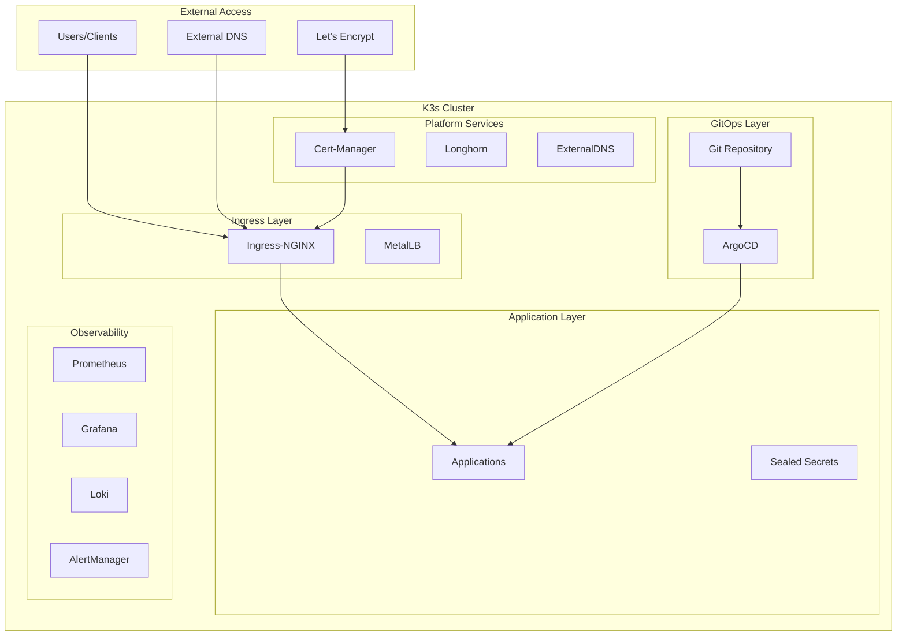

# K3s Infrastructure Platform

A production-ready Kubernetes infrastructure platform built on K3s, combining Ansible for initial provisioning with GitOps (ArgoCD) for continuous deployment and management.

## 🚀 Quick Start

### Prerequisites

- Ubuntu 20.04+ servers (minimum 3 nodes recommended)
- Ansible 2.9+
- Git
- SSH access to target nodes

### 1. Initialize the Infrastructure

```bash
# Clone the repository
git clone <repository-url>
cd setup

# Configure your inventory
cp infrastructure/inventory/dev/hosts.yaml.example infrastructure/inventory/production/hosts.yaml
# Edit the hosts.yaml file with your server details

# Deploy the complete platform
cd infrastructure
ansible-playbook -i inventory/production/hosts.yaml playbooks/site.yaml
```

### 2. Access the Platform

```bash
# Get cluster access
scp user@control-node:/etc/rancher/k3s/k3s.yaml ~/.kube/config
sed -i 's/127.0.0.1/your-control-node-ip/g' ~/.kube/config

# Access ArgoCD (get admin password)
kubectl -n argocd get secret argocd-initial-admin-secret -o jsonpath="{.data.password}" | base64 -d
kubectl port-forward -n argocd svc/argocd-server 8080:443

# Access Grafana monitoring
kubectl port-forward -n monitoring svc/grafana 3000:80
```

## 🏗️ Architecture Overview

Our platform implements a modern GitOps-based infrastructure with the following components:



### 🔧 Core Components

| Component | Purpose | Status |
|-----------|---------|--------|
| **K3s** | Lightweight Kubernetes distribution | ✅ |
| **MetalLB** | Bare-metal load balancer | ✅ |
| **Ingress-NGINX** | Ingress controller for HTTP/HTTPS traffic | ✅ |
| **Cert-Manager** | Automatic SSL/TLS certificate management | ✅ |
| **Longhorn** | Distributed block storage | ✅ |
| **ArgoCD** | GitOps continuous deployment | ✅ |
| **ExternalDNS** | Automatic DNS record management | ✅ |
| **Sealed Secrets** | Encrypted secrets in Git | ✅ |
| **Prometheus Stack** | Monitoring and alerting | ✅ |

### 🎯 Key Features

- **GitOps Workflow**: Complete Git-based deployment and management
- **High Availability**: Multi-master K3s setup with automated failover
- **Automatic SSL**: Let's Encrypt integration with cert-manager
- **Distributed Storage**: Longhorn for persistent volumes
- **Comprehensive Monitoring**: Prometheus, Grafana, and AlertManager
- **Security Hardened**: Network policies, RBAC, and pod security standards
- **Automated Backups**: etcd and application data backup strategies

## 📁 Project Structure

```
setup/
├── docs/                          # Comprehensive documentation
│   ├── architecture/              # System design and architecture
│   ├── development/               # GitOps workflow and app onboarding
│   ├── operations/                # Day-to-day operational procedures
│   ├── runbooks/                  # Step-by-step operational runbooks
│   └── security/                  # Security policies and procedures
├── infrastructure/                # Ansible automation
│   ├── inventory/                 # Environment-specific configurations
│   ├── playbooks/                 # Ansible playbooks
│   ├── roles/                     # Reusable Ansible roles
│   └── scripts/                   # Utility scripts
├── gitops/                        # GitOps manifests and applications
│   ├── applications/              # Application Helm charts
│   ├── argocd/                    # ArgoCD application definitions
│   ├── environments/              # Environment-specific configs
│   └── secrets/                   # Sealed secrets by environment
└── .github/workflows/             # CI/CD automation
```

## 🔧 Getting Started

### 1. Environment Setup

**For Development:**
```bash
# Setup local development environment
./setup.sh --environment dev

# Deploy to development cluster
ansible-playbook -i inventory/dev/hosts.yaml playbooks/site.yaml
```

**For Production:**
```bash
# Setup production environment
./setup.sh --environment production

# Deploy to production cluster
ansible-playbook -i inventory/production/hosts.yaml playbooks/site.yaml --ask-vault-pass
```

### 2. Application Deployment

Applications are deployed using GitOps principles with ArgoCD:

```bash
# Add a new application
mkdir -p gitops/applications/my-app/{base,environments}

# Create Helm chart structure
# (See docs/development/README.md for detailed instructions)

# Create ArgoCD application
kubectl apply -f gitops/argocd/applications/my-app.yaml
```

### 3. Monitoring and Operations

```bash
# Check cluster health
kubectl get nodes
kubectl get pods --all-namespaces

# Access monitoring dashboards
kubectl port-forward -n monitoring svc/grafana 3000:80

# View logs
kubectl logs -f deployment/my-app -n my-namespace
```

## 📚 Documentation

| Guide | Description |
|-------|-------------|
| [🏗️ Architecture](./docs/architecture/README.md) | System design, components, and data flow |
| [🚀 Development](./docs/development/README.md) | GitOps workflow and application onboarding |
| [⚙️ Operations](./docs/operations/README.md) | Monitoring, scaling, and maintenance procedures |
| [📋 Runbooks](./docs/runbooks/README.md) | Step-by-step operational procedures |
| [🛡️ Security](./docs/security/README.md) | Security policies, RBAC, and hardening |

## 🔄 CI/CD Pipeline

Our automated CI/CD pipeline includes:

- **Code Quality**: YAML linting, Ansible validation, markdown checking
- **Security Scanning**: Container image scanning, Kubernetes manifest analysis
- **Integration Testing**: Kind-based testing of K3s components
- **GitOps Validation**: ArgoCD application deployment testing
- **Infrastructure Testing**: Ansible playbook validation and syntax checking

### Pipeline Status

| Workflow | Status | Purpose |
|----------|--------|---------|
| CI - Infrastructure & GitOps Validation |  | Validate all changes |
| Integration Tests |  | End-to-end testing |

## 🛠️ Common Operations

### Scaling Applications
```bash
# Scale deployment
kubectl scale deployment my-app --replicas=5 -n my-namespace

# Update via GitOps (recommended)
# Edit values.yaml in gitops/applications/my-app/environments/production/
git add . && git commit -m "Scale my-app to 5 replicas" && git push
```

### Managing Secrets
```bash
# Create sealed secret
kubectl create secret generic my-secret --from-literal=key=value --dry-run=client -o yaml | \
kubeseal -o yaml > my-sealed-secret.yaml

# Apply sealed secret
kubectl apply -f my-sealed-secret.yaml
```

### Backup and Restore
```bash
# Manual etcd backup
k3s etcd-snapshot save --name manual-backup-$(date +%Y%m%d)

# List backups
k3s etcd-snapshot ls

# Restore from backup (see runbooks for full procedure)
k3s etcd-snapshot restore --name backup-name
```

## 🚨 Emergency Procedures

### Quick Health Checks
```bash
# Cluster status
kubectl get nodes
kubectl get pods --all-namespaces | grep -v Running

# ArgoCD applications
kubectl get applications -n argocd

# Critical services
kubectl get pods -n kube-system
kubectl get pods -n ingress-nginx
kubectl get pods -n monitoring
```

### Emergency Contacts

- **Primary On-Call**: [Your contact information]
- **Secondary On-Call**: [Backup contact]
- **Infrastructure Team**: [Team contact]

## 🤝 Contributing

1. **Fork the repository**
2. **Create a feature branch**: `git checkout -b feature/my-feature`
3. **Make changes and test**: Follow the development workflow in `docs/development/`
4. **Submit a pull request**: Ensure all CI checks pass

### Development Workflow

```bash
# Create feature branch
git checkout -b feature/new-component

# Make changes and test locally
ansible-playbook --syntax-check playbooks/site.yaml
helm lint gitops/applications/my-app/base/

# Commit and push
git add .
git commit -m "feat: add new component"
git push origin feature/new-component

# Create pull request - CI will run automatically
```

## 📊 Monitoring and Metrics

### Key Metrics

- **Cluster Health**: Node status, pod status, resource utilization
- **Application Performance**: Response time, throughput, error rates
- **Infrastructure Metrics**: CPU, memory, disk, network utilization
- **Security Events**: Failed authentications, policy violations

### Dashboards

| Dashboard | URL | Purpose |
|-----------|-----|---------|
| Grafana | `http://localhost:3000` | Main monitoring dashboard |
| Prometheus | `http://localhost:9090` | Metrics and alerts |
| ArgoCD | `https://localhost:8080` | GitOps application status |
| Longhorn | `http://localhost:8081` | Storage management |

## 🔧 Troubleshooting

### Common Issues

| Issue | Solution |
|-------|----------|
| Pods stuck in Pending | Check resource requests/limits and node capacity |
| Certificate issues | Verify cert-manager and Let's Encrypt configuration |
| Storage problems | Check Longhorn dashboard and volume status |
| Network connectivity | Verify network policies and ingress configuration |
| ArgoCD sync issues | Check repository access and application manifests |

### Getting Help

1. **Check the documentation** in the `docs/` directory
2. **Review runbooks** for step-by-step procedures
3. **Check logs**: `kubectl logs <pod-name> -n <namespace>`
4. **Contact the team** using emergency contact information

## 📋 License

This project is licensed under the MIT License - see the [LICENSE](LICENSE) file for details.

## 🙏 Acknowledgments

- **K3s** team for the lightweight Kubernetes distribution
- **ArgoCD** project for GitOps capabilities
- **Prometheus** community for monitoring tools
- **Ansible** community for automation framework

---

*For detailed operational procedures and troubleshooting, see the comprehensive documentation in the `docs/` directory.*
