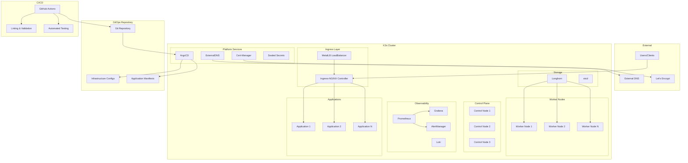
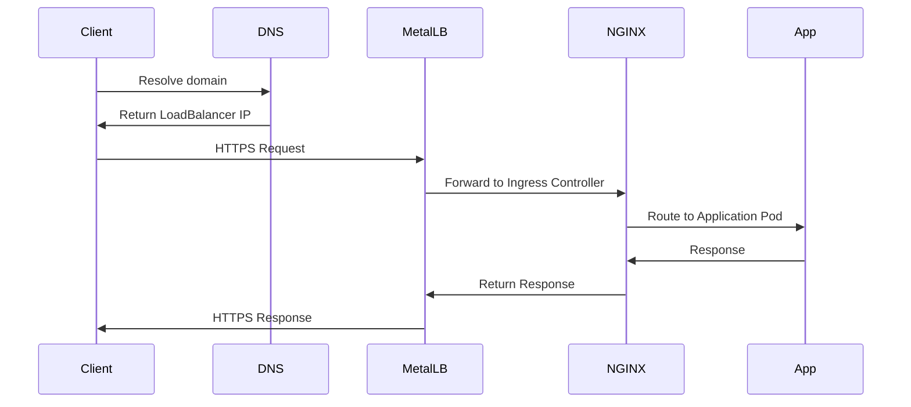

# Architecture Overview

This document provides a high-level overview of our K3s-based infrastructure architecture, combining Ansible for initial provisioning with GitOps (ArgoCD) for continuous deployment.

## 🏗️ System Architecture

## 🎯 Design Principles

### 1. **Infrastructure as Code**
- All infrastructure is defined declaratively using Ansible playbooks
- Configuration management through Git version control
- Reproducible deployments across environments

### 2. **GitOps Workflow**
- ArgoCD manages application lifecycle from Git repository
- Declarative application configuration using Helm charts and Kubernetes manifests
- Continuous deployment with automatic synchronization

### 3. **High Availability**
- Multi-node control plane for K3s cluster resilience
- Distributed storage with Longhorn for data persistence
- Load balancing with MetalLB for service availability

### 4. **Security First**
- Automated TLS certificate management with Cert-Manager
- Encrypted secrets management using Sealed Secrets
- Network policies and RBAC for access control

### 5. **Observability**
- Comprehensive monitoring with Prometheus and Grafana
- Centralized logging with Loki
- Alerting and notification systems

## 🔧 Core Components

### K3s Cluster Foundation
- **Distribution**: Lightweight Kubernetes (K3s) for efficient resource usage
- **Networking**: Flannel CNI for pod-to-pod communication
- **Storage**: Longhorn for distributed persistent storage
- **Load Balancing**: MetalLB for bare-metal LoadBalancer services

### Platform Services
- **ArgoCD**: GitOps continuous delivery for applications and infrastructure
- **Ingress-NGINX**: HTTP/HTTPS ingress controller for external access
- **Cert-Manager**: Automated TLS certificate provisioning from Let's Encrypt
- **ExternalDNS**: Automatic DNS record management
- **Sealed Secrets**: Encrypted secrets management in Git

### Observability Stack
- **Prometheus**: Metrics collection and storage
- **Grafana**: Visualization and dashboards
- **AlertManager**: Alert routing and notification
- **Loki**: Log aggregation and querying

## 🌐 Network Architecture

### Ingress Flow

### DNS & Certificate Management
- **ExternalDNS** automatically creates DNS records for ingress resources
- **Cert-Manager** provisions and renews TLS certificates from Let's Encrypt
- **Wildcard certificates** reduce certificate management overhead

## 💾 Storage Architecture

### Longhorn Distributed Storage
- **Replicated Storage**: Data replicated across multiple nodes
- **Backup Strategy**: Automated backups to external storage
- **Volume Management**: Dynamic provisioning of persistent volumes
- **Disaster Recovery**: Cross-cluster backup and restore capabilities

## 🔄 Deployment Pipeline

### Infrastructure (Ansible)
1. **Node Preparation**: Base OS configuration and hardening
2. **K3s Installation**: Cluster bootstrap and node joining
3. **Platform Setup**: Core services and add-ons deployment

### Applications (GitOps)
1. **Git Commit**: Developer pushes changes to Git repository
2. **CI Pipeline**: Automated validation and testing
3. **ArgoCD Sync**: Automatic deployment to target environment
4. **Health Checks**: Verify application deployment success

## 🔐 Security Architecture

### Access Control
- **RBAC**: Role-based access control for users and services
- **Service Accounts**: Dedicated accounts for applications and services
- **Network Policies**: Micro-segmentation for pod communication

### Secrets Management
- **Sealed Secrets**: Encrypted secrets stored in Git
- **Secret Encryption**: Kubernetes secrets encrypted at rest
- **Certificate Rotation**: Automated TLS certificate renewal

## 📊 Monitoring & Observability

### Metrics Collection
- **Node Metrics**: CPU, memory, disk, and network utilization
- **Application Metrics**: Custom application metrics via Prometheus
- **Cluster Metrics**: Kubernetes API server and cluster component metrics

### Logging Strategy
- **Centralized Logging**: All logs aggregated in Loki
- **Structured Logging**: JSON-formatted logs for better parsing
- **Log Retention**: Configurable retention policies

### Alerting
- **Threshold Alerts**: CPU, memory, and disk usage alerts
- **Application Alerts**: Custom application health checks
- **Infrastructure Alerts**: Cluster component health monitoring

## 🚀 Scalability Considerations

### Horizontal Scaling
- **Node Addition**: Automated node joining with Ansible
- **Application Scaling**: HPA (Horizontal Pod Autoscaler) for applications
- **Load Distribution**: MetalLB manages traffic distribution

### Vertical Scaling
- **Resource Limits**: Configured resource requests and limits
- **VPA Integration**: Vertical Pod Autoscaler for resource optimization
- **Storage Scaling**: Longhorn volume expansion capabilities

## 🔧 Technology Stack

| Component | Technology | Purpose |
|-----------|------------|---------|
| **Container Runtime** | containerd | Container execution |
| **Orchestration** | K3s (Kubernetes) | Container orchestration |
| **Networking** | Flannel CNI | Pod networking |
| **Load Balancing** | MetalLB | LoadBalancer services |
| **Ingress** | Ingress-NGINX | HTTP/HTTPS ingress |
| **Storage** | Longhorn | Distributed storage |
| **GitOps** | ArgoCD | Continuous deployment |
| **Certificates** | Cert-Manager | TLS automation |
| **DNS** | ExternalDNS | DNS automation |
| **Secrets** | Sealed Secrets | Encrypted secrets |
| **Monitoring** | Prometheus | Metrics collection |
| **Visualization** | Grafana | Dashboards |
| **Logging** | Loki | Log aggregation |
| **Configuration** | Ansible | Infrastructure automation |

## 📈 Environment Strategy

### Multi-Environment Support
- **Development**: Lightweight setup for development and testing
- **Staging**: Production-like environment for validation
- **Production**: High-availability setup with full monitoring

### Environment Promotion
- **GitOps Flow**: Changes promoted through Git branches
- **Automated Testing**: CI/CD validates changes before promotion
- **Rollback Strategy**: Quick rollback using Git revert

---

*This architecture is designed to be scalable, maintainable, and secure while following cloud-native best practices.* 