# K3s Homelab Architecture
**Comprehensive system design for production-ready Kubernetes homelab infrastructure.**
## 🏗️ High-Level Architecture

```mermaid
graph TB
    subgraph "External Access"
        Users[👥 Users/Clients]
        DNS[🌐 External DNS]
        LE[🔒 Let's Encrypt]
    end

    subgraph "K3s Cluster (7 Nodes)"
        subgraph "Control Plane (HA)"
            CP1[🖥️ dream-machine<br/>Control+Worker]
            CP2[🥧 pi-m2<br/>Control Plane]
            CP3[🥧 pi-m3<br/>Control Plane]
            VIP[⚖️ HAProxy VIP<br/>192.168.1.10]
        end

        subgraph "Worker Nodes"
            W1[🥧 pi-n1<br/>Worker]
            W2[🥧 pi-n2<br/>Worker]
            W3[🥧 pi-n3<br/>Worker]
            W4[🥧 pi-n4<br/>Worker]
        end

        subgraph "Ingress Layer"
            MLB[🔄 MetalLB<br/>10.0.0.30-50]
            NGINX[🚪 Ingress-NGINX<br/>HTTP/HTTPS]
        end

        subgraph "GitOps Layer"
            ARGOCD[🔄 ArgoCD<br/>Continuous Deployment]
            GIT[📂 Git Repository<br/>Source of Truth]
        end

        subgraph "Platform Services"
            CERT[🔐 cert-manager<br/>TLS Automation]
            STORAGE[💾 Longhorn<br/>Distributed Storage]
            SECRETS[🔑 Sealed Secrets<br/>GitOps-safe Secrets]
        end

        subgraph "Observability"
            PROM[📊 Prometheus<br/>Metrics Collection]
            GRAF[📈 Grafana<br/>Visualization]
            LOKI[📝 Loki<br/>Log Aggregation]
            ALERT[🚨 AlertManager<br/>Alert Routing]
        end

        subgraph "Applications"
            APPS[🚀 User Applications<br/>Deployed via GitOps]
        end
    end

    Users --> NGINX
    DNS --> MLB
    LE --> CERT
    NGINX --> APPS
    ARGOCD --> APPS
    GIT --> ARGOCD
    CERT --> NGINX
    VIP --> CP1
    VIP --> CP2
    VIP --> CP3
```

## 🎯 Design Principles

### High Availability

- **3-node control plane** with HAProxy + keepalived VIP
- **Distributed storage** with 3-replica redundancy
- **Multi-zone deployment** across different Pi models
- **Automated failover** for all critical components
### GitOps-First

- **Declarative configuration** stored in Git
- **Automated deployment** via ArgoCD
- **Environment separation** (dev/production)
- **Drift detection** and automatic remediation
### Security by Design

- **TLS everywhere** with automatic certificate management
- **Network segmentation** via policies
- **RBAC enforcement** across all components
- **Sealed secrets** for GitOps-safe secret management
### Observability

- **Comprehensive metrics** collection with Prometheus
- **Centralized logging** via Loki
- **Rich dashboards** in Grafana
- **Proactive alerting** with AlertManager
## 🏛️ Infrastructure Components

### Node Architecture
| Node | Role | Specs | Services |
|------|------|-------|----------|
| **dream-machine** | Control+Worker | x86_64, 32GB RAM | K3s Control, Workloads |
| **pi-m2** | Control Plane | ARM64, 8GB RAM | K3s Control, etcd |
| **pi-m3** | Control Plane | ARM64, 8GB RAM | K3s Control, etcd |
| **pi-n1** | Worker | ARM64, 8GB RAM | Workloads, Storage |
| **pi-n2** | Worker | ARM64, 8GB RAM | Workloads, Storage |
| **pi-n3** | Worker | ARM64, 8GB RAM | Workloads, Storage |
| **pi-n4** | Worker | ARM64, 8GB RAM | Workloads, Storage |
### Network Architecture

```mermaid
graph LR
    subgraph "External Network"
        Internet[🌐 Internet]
        Router[🔌 Router<br/>192.168.1.1]
    end

    subgraph "Cluster Network"
        VIP[⚖️ VIP<br/>192.168.1.10]
        LB_Pool[🔄 LoadBalancer Pool<br/>10.0.0.30-50]

        subgraph "Node Network"
            DM[dream-machine<br/>192.168.1.100]
            M2[pi-m2<br/>192.168.1.102]
            M3[pi-m3<br/>192.168.1.103]
            N1[pi-n1<br/>192.168.1.101]
            N2[pi-n2<br/>192.168.1.104]
            N3[pi-n3<br/>192.168.1.105]
            N4[pi-n4<br/>192.168.1.106]
        end

        subgraph "Pod Network"
            PodCIDR[Pod CIDR<br/>10.42.0.0/16]
            SvcCIDR[Service CIDR<br/>10.43.0.0/16]
        end
    end

    Internet --> Router
    Router --> VIP
    Router --> LB_Pool
    VIP --> DM
    VIP --> M2
    VIP --> M3
```

## 🔧 Core Platform Services

### Load Balancing & Ingress
**MetalLB Configuration:**
```yaml

# MetalLB IP Pool

apiVersion: metallb.io/v1beta1
kind: IPAddressPool
metadata:
  name: production-pool
spec:
  addresses:
  - 10.0.0.30-10.0.0.50
```

**Ingress-NGINX Features:**
- Layer 7 load balancing
- SSL termination
- WAF capabilities
- Rate limiting
- Request routing
### Storage Architecture
**Longhorn Distributed Storage:**
```yaml

# Storage Class Configuration

apiVersion: storage.k8s.io/v1
kind: StorageClass
metadata:
  name: longhorn
provisioner: driver.longhorn.io
parameters:
  numberOfReplicas: "3"
  staleReplicaTimeout: "30"
  fromBackup: ""
```

**Storage Features:**
- **3-replica redundancy** across worker nodes
- **Automatic backup** to S3-compatible storage
- **Snapshot management** for point-in-time recovery
- **Volume expansion** without downtime
- **Cross-node replication** for high availability
### GitOps Platform
**ArgoCD Configuration:**
```yaml

# Application Set for Infrastructure

apiVersion: argoproj.io/v1alpha1
kind: ApplicationSet
metadata:
  name: infrastructure-core
spec:
  generators:
  - list:
      elements:
      - cluster: k3s-production
        environment: production
        values_file: gitops/environments/production/values.yaml
```

**GitOps Features:**
- **Multi-environment support** (dev/production)
- **Automated sync** with drift detection
- **Progressive rollouts** with health checks
- **Rollback capabilities** on failure
- **RBAC integration** for secure access
## 🔐 Security Architecture

### Certificate Management
**cert-manager Integration:**
```yaml

# Let's Encrypt ClusterIssuer

apiVersion: cert-manager.io/v1
kind: ClusterIssuer
metadata:
  name: letsencrypt-production
spec:
  acme:
    server: https://acme-v02.api.letsencrypt.org/directory
    email: admin@cluster.local
    privateKeySecretRef:
      name: letsencrypt-production
    solvers:
    - http01:
        ingress:
          class: nginx
```
### Secret Management
**Sealed Secrets Workflow:**
```bash

# Create sealed secret

kubectl create secret generic my-secret \
  --from-literal=password=supersecret \
  --dry-run=client -o yaml | \
kubeseal -o yaml > my-sealed-secret.yaml
# Commit to Git (safe)

git add my-sealed-secret.yaml
git commit -m "Add application secret"
```
### Network Security
**Network Policies:**
```yaml

# Default deny-all policy

apiVersion: networking.k8s.io/v1
kind: NetworkPolicy
metadata:
  name: default-deny-all
spec:
  podSelector: {}
  policyTypes:
  - Ingress
  - Egress
```
## 📊 Observability Stack

### Monitoring Architecture

```mermaid
graph TB
    subgraph "Data Sources"
        Nodes[📊 Node Metrics]
        Pods[🚀 Pod Metrics]
        Apps[📱 Application Metrics]
        Logs[📝 Application Logs]
    end

    subgraph "Collection Layer"
        NodeExp[node-exporter]
        PodMon[Pod Monitoring]
        Promtail[Promtail]
    end

    subgraph "Storage Layer"
        Prometheus[📊 Prometheus<br/>Metrics Store]
        Loki[📝 Loki<br/>Log Store]
    end

    subgraph "Visualization"
        Grafana[📈 Grafana<br/>Dashboards]
        AlertMgr[🚨 AlertManager<br/>Notifications]
    end

    Nodes --> NodeExp
    Pods --> PodMon
    Apps --> PodMon
    Logs --> Promtail

    NodeExp --> Prometheus
    PodMon --> Prometheus
    Promtail --> Loki

    Prometheus --> Grafana
    Prometheus --> AlertMgr
    Loki --> Grafana
```

### Key Metrics & Dashboards
**Infrastructure Metrics:**
- Node CPU, memory, disk utilization
- Network throughput and latency
- Storage performance and capacity
- Container resource consumption

**Application Metrics:**
- Request rate, latency, error rate (RED)
- Utilization, saturation, errors (USE)
- Business-specific KPIs
- Custom application metrics

**Sample Grafana Dashboard Query:**
```promql

# CPU utilization by node

100 - (avg by (instance) (rate(node_cpu_seconds_total{mode="idle"}[5m])) * 100)
# Pod memory usage

container_memory_usage_bytes{container!="POD",container!=""}
# Ingress request rate

rate(nginx_ingress_controller_requests_total[5m])
```
## 🌍 Environment Configurations

### Development Environment
**Purpose:** Single-node development and testing
```yaml

# Dev environment characteristics

global:
  environment: dev
  domain: "dev.localhost"
  cluster_name: "k3s-dev-local"
# Minimal resource allocation

resources:
  requests:
    cpu: 50m
    memory: 128Mi
  limits:
    cpu: 200m
    memory: 256Mi
# Simplified services

services:
  metallb: false      # Use NodePort
  longhorn: false     # Use local storage
  argocd: false       # Manual deployment
```
### Production Environment
**Purpose:** Full production workloads
```yaml

# Production environment characteristics

global:
  environment: production
  domain: "cluster.local"
  cluster_name: "k3s-production"
# Full resource allocation

resources:
  requests:
    cpu: 500m
    memory: 2Gi
  limits:
    cpu: 2000m
    memory: 4Gi
# Complete service stack

services:
  metallb: true       # LoadBalancer services
  longhorn: true      # Distributed storage
  argocd: true        # Full GitOps
  monitoring: true    # Complete observability
```
## 🔄 Data Flow Architecture

### Application Deployment Flow

### Monitoring Data Flow

## 🚀 Scaling Considerations

### Horizontal Scaling
**Node Addition:**
```bash

# Add new worker node

ansible-playbook -i inventory/production/hosts.yaml \
  playbooks/add-node.yaml \
  --extra-vars "target_node=pi-n5"
```

**Application Scaling:**
```yaml

# HorizontalPodAutoscaler

apiVersion: autoscaling/v2
kind: HorizontalPodAutoscaler
metadata:
  name: my-app-hpa
spec:
  scaleTargetRef:
    apiVersion: apps/v1
    kind: Deployment
    name: my-app
  minReplicas: 2
  maxReplicas: 10
  metrics:
  - type: Resource
    resource:
      name: cpu
      target:
        type: Utilization
        averageUtilization: 70
```
### Vertical Scaling
**Resource Adjustment:**
```yaml

# Vertical Pod Autoscaler

apiVersion: autoscaling.k8s.io/v1
kind: VerticalPodAutoscaler
metadata:
  name: my-app-vpa
spec:
  targetRef:
    apiVersion: apps/v1
    kind: Deployment
    name: my-app
  updatePolicy:
    updateMode: "Auto"
```
## 🔧 Troubleshooting Architecture

### Health Check Commands
```bash

# Cluster health

kubectl get nodes -o wide
kubectl get pods -A | grep -v Running
# Component status

kubectl get applications -n argocd
kubectl get certificates -A
kubectl get volumes -n longhorn-system
# Network connectivity

kubectl get svc -A --field-selector=spec.type=LoadBalancer
kubectl get ingress -A
```
### Common Architecture Issues
| Issue | Symptoms | Resolution |
|-------|----------|------------|
| **Split-brain** | Multiple masters active | Check HAProxy/keepalived config |
| **Storage failure** | PVCs stuck pending | Verify Longhorn node health |
| **Certificate issues** | TLS errors | Check cert-manager logs |
| **GitOps drift** | Applications OutOfSync | Force ArgoCD resync |
## 📚 Related Documentation
- **[Operations Guide](../operations/README.md)** - Day-to-day operational procedures
- **[Development Workflow](../development/README.md)** - Application deployment via GitOps
- **[Security Policies](../security/README.md)** - Security configurations and best practices
- **[Runbooks](../runbooks/README.md)** - Step-by-step operational procedures

---

**This architecture provides a solid foundation for production Kubernetes workloads with enterprise-grade features in a homelab environment.**
