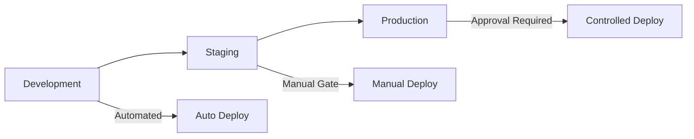

# Operations Guide

This guide covers day-to-day operational procedures for managing the K3s-based infrastructure platform.

## 📊 Monitoring & Observability

### Prometheus Stack Overview

Our monitoring solution consists of:
- **Prometheus**: Metrics collection and storage
- **Grafana**: Visualization and dashboards
- **AlertManager**: Alert routing and notifications
- **Loki**: Log aggregation and querying

### Accessing Monitoring Services

```bash
# Port forward to access Grafana locally
kubectl port-forward -n monitoring svc/grafana 3000:80

# Port forward to access Prometheus
kubectl port-forward -n monitoring svc/prometheus-server 9090:80

# Port forward to access AlertManager
kubectl port-forward -n monitoring svc/alertmanager 9093:9093
```

### Key Metrics to Monitor

#### Node-Level Metrics
- **CPU Usage**: `100 - (avg by(instance) (rate(node_cpu_seconds_total{mode="idle"}[5m])) * 100)`
- **Memory Usage**: `(1 - (node_memory_MemAvailable_bytes / node_memory_MemTotal_bytes)) * 100`
- **Disk Usage**: `100 - ((node_filesystem_avail_bytes * 100) / node_filesystem_size_bytes)`
- **Network I/O**: `rate(node_network_receive_bytes_total[5m])` and `rate(node_network_transmit_bytes_total[5m])`

#### Cluster-Level Metrics
- **Pod Status**: Monitor pod restarts, failures, and pending states
- **Node Status**: Track node readiness and resource capacity
- **API Server**: Monitor API server latency and error rates
- **etcd**: Watch etcd cluster health and performance

#### Application Metrics
- **Request Rate**: HTTP requests per second
- **Response Time**: 95th percentile response times
- **Error Rate**: HTTP error rates (4xx, 5xx)
- **Resource Usage**: Application CPU and memory consumption

### Setting Up Alerts

Default alerting rules are configured for:
- High CPU/Memory usage (>80% for 5 minutes)
- Disk space low (<10% free)
- Pod restart loops
- Node down conditions
- Certificate expiration warnings

## 🔄 Backup & Recovery

### Automated Backup Strategy

#### etcd Backups
```bash
# Manual etcd backup
sudo k3s etcd-snapshot save

# View existing snapshots
sudo k3s etcd-snapshot ls

# Restore from snapshot (CAUTION: This will replace current data)
sudo k3s etcd-snapshot restore snapshot-name
```

#### Longhorn Volume Backups
```bash
# Create volume backup (via Longhorn UI or kubectl)
kubectl apply -f - <<EOF
apiVersion: longhorn.io/v1beta1
kind: Backup
metadata:
  name: backup-$(date +%Y%m%d-%H%M%S)
  namespace: longhorn-system
spec:
  snapshotName: snapshot-name
EOF
```

#### Application Data Backups
```bash
# Example: Backup PostgreSQL database
kubectl exec -n app-namespace postgres-pod -- pg_dump -U username dbname > backup.sql

# Example: Backup persistent volumes
kubectl exec -n app-namespace app-pod -- tar czf - /data | gzip > volume-backup.tar.gz
```

### Recovery Procedures

#### Cluster Recovery
1. **Single Node Failure**: K3s automatically handles single node failures
2. **Control Plane Recovery**: Restore from etcd snapshot if control plane is corrupted
3. **Complete Cluster Rebuild**: Use Ansible playbooks to rebuild from scratch

#### Application Recovery
1. **Pod Recovery**: Kubernetes automatically restarts failed pods
2. **Volume Recovery**: Restore from Longhorn backups
3. **Database Recovery**: Restore from database-specific backups

### Backup Verification
```bash
# Test etcd snapshot integrity
sudo k3s etcd-snapshot ls --name snapshot-name

# Verify Longhorn backup status
kubectl get backups -n longhorn-system

# Test application backup restoration in dev environment
# (Always test backups in non-production first)
```

## ⚖️ Scaling Procedures

### Horizontal Scaling

#### Adding Worker Nodes
```bash
# Run Ansible playbook to add new nodes
cd infrastructure/
ansible-playbook -i inventory/production/hosts.yaml playbooks/scale-cluster.yaml --extra-vars "new_nodes=node4,node5"
```

#### Scaling Applications
```bash
# Scale deployment manually
kubectl scale deployment app-name --replicas=5 -n app-namespace

# Enable Horizontal Pod Autoscaler (HPA)
kubectl autoscale deployment app-name --cpu-percent=80 --min=2 --max=10 -n app-namespace

# View HPA status
kubectl get hpa -n app-namespace
```

### Vertical Scaling

#### Increasing Node Resources
1. **Physical/VM Resources**: Add CPU/Memory to nodes via hypervisor
2. **Update Kubernetes**: Restart kubelet to recognize new resources
3. **Verify**: Check `kubectl describe nodes` for updated capacity

#### Application Resource Limits
```bash
# Update deployment resource limits
kubectl patch deployment app-name -n app-namespace -p '{"spec":{"template":{"spec":{"containers":[{"name":"container-name","resources":{"limits":{"cpu":"2","memory":"4Gi"},"requests":{"cpu":"1","memory":"2Gi"}}}]}}}}'
```

### Storage Scaling

#### Expanding Longhorn Volumes
```bash
# Expand persistent volume
kubectl patch pvc pvc-name -n app-namespace -p '{"spec":{"resources":{"requests":{"storage":"20Gi"}}}}'

# Verify expansion
kubectl get pvc -n app-namespace
```

## 🔧 Troubleshooting

### Common Issues and Solutions

#### Node Issues
```bash
# Check node status
kubectl get nodes -o wide

# Describe problematic node
kubectl describe node node-name

# Check node logs
journalctl -u k3s -f

# Restart K3s service
sudo systemctl restart k3s
```

#### Pod Issues
```bash
# Check pod status
kubectl get pods -n namespace --show-labels

# Get pod details
kubectl describe pod pod-name -n namespace

# Check pod logs
kubectl logs -f pod-name -n namespace

# Debug with interactive shell
kubectl exec -it pod-name -n namespace -- /bin/sh
```

#### Network Issues
```bash
# Check ingress status
kubectl get ingress -A

# Verify LoadBalancer services
kubectl get svc -A --field-selector spec.type=LoadBalancer

# Test DNS resolution
kubectl run -it --rm debug --image=busybox --restart=Never -- nslookup kubernetes.default

# Check MetalLB status
kubectl get pods -n metallb-system
kubectl logs -n metallb-system -l app=metallb
```

#### Storage Issues
```bash
# Check Longhorn system status
kubectl get pods -n longhorn-system

# View volume status
kubectl get pv,pvc -A

# Check Longhorn UI for detailed storage info
kubectl port-forward -n longhorn-system svc/longhorn-frontend 8080:80
```

### Performance Troubleshooting

#### High CPU Usage
1. **Identify source**: Use `kubectl top pods -A` and `kubectl top nodes`
2. **Scale resources**: Increase pod CPU limits or scale horizontally
3. **Optimize applications**: Review application performance and resource usage patterns

#### Memory Issues
1. **Check OOMKills**: `dmesg | grep -i "killed process"`
2. **Analyze memory usage**: Use Grafana dashboards for detailed memory analysis
3. **Adjust limits**: Increase memory limits or optimize application memory usage

#### Disk Space Issues
1. **Clean up logs**: `journalctl --vacuum-time=7d`
2. **Remove unused images**: `sudo k3s crictl rmi --prune`
3. **Expand volumes**: Follow storage scaling procedures above

### Emergency Procedures

#### Cluster Unresponsive
1. **Check control plane**: `kubectl get nodes`
2. **Restart K3s**: `sudo systemctl restart k3s`
3. **Restore from backup**: Use etcd snapshot restoration if needed

#### Application Down
1. **Check pod status**: `kubectl get pods -n app-namespace`
2. **Review logs**: `kubectl logs -f deployment/app-name -n app-namespace`
3. **Restart deployment**: `kubectl rollout restart deployment/app-name -n app-namespace`

#### Network Connectivity Lost
1. **Check MetalLB**: `kubectl get pods -n metallb-system`
2. **Verify ingress**: `kubectl get ingress -A`
3. **Test internal connectivity**: Deploy debug pod and test connectivity

## 🌍 Environment Management

### Environment Overview

| Environment | Purpose | Resources | Monitoring |
|-------------|---------|-----------|------------|
| **Development** | Feature development and testing | Minimal resources | Basic monitoring |
| **Staging** | Pre-production validation | Production-like | Full monitoring |
| **Production** | Live applications | High availability | Comprehensive monitoring |

### Environment-Specific Operations

#### Development Environment
- **Purpose**: Fast iteration and testing
- **Deployment**: Automatic via ArgoCD on push to develop branches
- **Resources**: Shared node pool, lower resource limits
- **Data**: Test data, frequent resets acceptable

#### Staging Environment
- **Purpose**: Production validation and integration testing
- **Deployment**: Manual promotion from development
- **Resources**: Production-equivalent sizing
- **Data**: Production-like test data, stable

#### Production Environment
- **Purpose**: Live user-facing applications
- **Deployment**: Controlled promotion after staging validation
- **Resources**: High availability, dedicated resources
- **Data**: Live data, comprehensive backup and monitoring

### Environment Promotion Process



### Cross-Environment Consistency

#### Configuration Management
- Use environment-specific value files in GitOps repository
- Maintain consistent base configurations across environments
- Document any environment-specific deviations

#### Monitoring Consistency
- Deploy same monitoring stack across all environments
- Use environment labels for metric differentiation
- Maintain consistent alerting rules with environment-appropriate thresholds

## 📱 Daily Operations Checklist

### Morning Checks
- [ ] Review overnight alerts and incidents
- [ ] Check cluster health status in Grafana
- [ ] Verify backup completion status
- [ ] Review application performance metrics
- [ ] Check for any failed deployments

### Weekly Maintenance
- [ ] Review and clean up old container images
- [ ] Verify backup restoration procedures
- [ ] Update monitoring dashboards if needed
- [ ] Review and update documentation
- [ ] Plan for upcoming capacity needs

### Monthly Tasks
- [ ] Review security patches and updates
- [ ] Analyze resource usage trends
- [ ] Update disaster recovery documentation
- [ ] Review and optimize monitoring alerts
- [ ] Conduct backup restoration tests

---

*For emergency situations, refer to the [Emergency Runbooks](../runbooks/) for detailed step-by-step procedures.* 